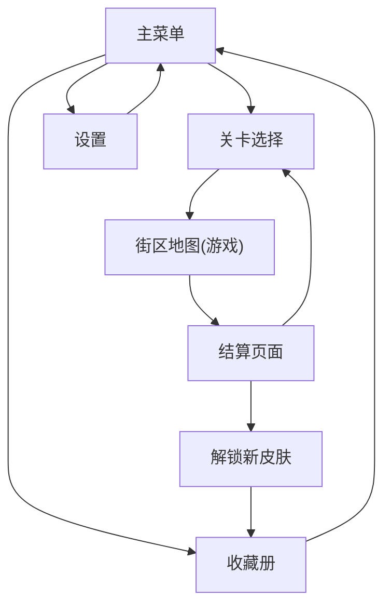

## 1. 产品概述

复古风像素送报桌面游戏是一款面向休闲玩家的单机游戏，玩家扮演送报童骑着自行车在像素风格街区投递报纸，躲避障碍物并收集道具。游戏融合了经典街机风格与现代游戏设计，提供怀旧的像素视觉体验和轻松有趣的玩法。

- 核心目标：在限时内完成街区报纸投递，获得高分并解锁奖励
- 目标用户：喜欢复古像素风格、休闲街机游戏的玩家群体
- 市场价值：填补怀旧像素风格送报类游戏空白，提供轻松解压的单机体验

## 2. 核心功能

### 2.1 用户角色

| 角色 | 注册方式 | 核心权限 |
|------|----------|----------|
| 玩家 | 无需注册，本地存档 | 完整游戏体验、存档读取、皮肤解锁 |

### 2.2 功能模块

1. **主菜单页面**：游戏标题、开始游戏、关卡选择、收藏册、设置（怀旧滤镜/音乐开关）
2. **关卡选择页面**：街区列表、星级显示、三星条件预览、解锁进度
3. **街区地图（游戏核心）**：Canvas 像素渲染、玩家控制、障碍物系统、投递系统、道具系统、计分系统
4. **结算页面**：得分统计、星级评定、挑战目标完成情况、最高分记录、奖励展示
5. **收藏册页面**：已解锁自行车展示、已解锁报纸皮肤展示、未解锁预览

### 2.3 页面详情

| 页面名称 | 模块名称 | 功能描述 |
|----------|----------|----------|
| 主菜单 | 标题区 | 像素字体游戏标题，动态闪烁特效 |
| 主菜单 | 按钮区 | 开始游戏、关卡选择、收藏册、设置按钮，悬停像素动画 |
| 主菜单 | 背景 | 8-bit 像素风格循环动画背景 |
| 关卡选择 | 关卡列表 | 网格布局展示所有街区关卡，显示星级、最高分、锁定状态 |
| 关卡选择 | 三星条件预览 | 悬浮显示关卡三星挑战目标（限时/无伤/全收集） |
| 街区地图 | 玩家控制 | WASD/方向键移动，空格蓄力投递报纸 |
| 街区地图 | 障碍物 | 水坑（减速）、狗（追赶）、路障（碰撞扣分）、汽车（撞击扣血） |
| 街区地图 | 道具系统 | 金币（加分）、闹钟（增加时间）、护盾（临时无敌） |
| 街区地图 | 投递系统 | 按住蓄力调整力度，投递到邮箱或门口，连续命中奖励倍率 |
| 街区地图 | HUD | 得分、时间、生命值、报纸数量、连击数、蓄力条 |
| 结算页 | 得分统计 | 基础分、连击奖励、收集奖励、时间奖励、最终得分 |
| 结算页 | 星级评定 | 三星星级显示，对应条件勾选状态 |
| 结算页 | 最高分 | 本地存档显示历史最高分，新纪录动画特效 |
| 结算页 | 奖励展示 | 解锁新皮肤时展示解锁内容 |
| 收藏册 | 自行车展示 | 不同年代自行车像素展示，解锁状态、获取条件 |
| 收藏册 | 报纸皮肤 | 不同报纸样式展示，解锁条件、稀有度标签 |

## 3. 核心流程

玩家从主菜单开始，选择关卡进入街区地图，操控自行车投递报纸，躲避障碍收集道具，完成关卡后进入结算页面查看得分与星级，满足条件可解锁新皮肤，随时可进入收藏册查看已解锁内容。

## 4. 用户界面设计

### 4.1 设计风格
- **主色调**：深棕色(#2D1B0E)背景 + 暖黄色(#FFD93D)标题 + 复古绿(#6BCB77)按钮 + 像素红(#FF6B6B)强调
- **辅助色**：天空蓝(#87CEEB)、邮筒绿(#228B22)、报纸白(#F5F5DC)
- **按钮风格**：像素立体边框，按下凹陷效果，8-bit 色块
- **字体**：Press Start 2P 像素字体 + VT323 复古终端字体
- **布局风格**：像素网格对齐，模拟 CRT 扫描线效果，边框像素化装饰
- **图标样式**：纯像素绘制图标，8x8 / 16x16 规格，复古游戏手柄风格

### 4.2 页面设计概览

| 页面名称 | 模块名称 | UI 元素 |
|----------|----------|----------|
| 主菜单 | 标题区 | Press Start 2P 大标题、逐字显现动画、背景扫描线、像素闪烁星星 |
| 主菜单 | 按钮区 | 像素立体按钮、悬停高亮边、按下音效反馈、按钮图标左对齐 |
| 关卡选择 | 关卡卡片 | 16x16 像素缩略图、三星图标位置、锁定像素锁图标、最高分显示 |
| 关卡选择 | 条件提示 | 悬浮 tooltip、像素箭头指向、三行条件列表、勾选/未勾选样式 |
| 街区地图 | HUD 顶栏 | 左对齐得分+时间、右对齐生命+报纸、中间连击计数器、像素分隔线 |
| 街区地图 | 蓄力条 | 底部横向蓄力槽、渐变颜色、力度标记、释放瞬间闪光 |
| 结算页 | 星级展示 | 大号像素星星、逐颗点亮动画、未获得灰色轮廓、条件对勾列表 |
| 结算页 | 得分滚动 | 数字滚动动画、新纪录横幅闪烁、奖励皮肤弹窗像素边框 |
| 收藏册 | 展示卡片 | 自行车/报纸像素画、名称标签、解锁条件、已解锁彩色/未解锁灰度 |
| 设置 | 开关项 | 像素开关按钮、怀旧滤镜实时预览、音量滑块、CRT 效果切换 |

### 4.3 响应式
- **桌面优先**：游戏以 960x640 固定分辨率 Canvas 为核心，居中显示
- **自适应**：页面框架使用 Tailwind 响应式布局，在不同分辨率下保持居中
- **控制优化**：支持键盘(WASD/方向键/空格)与鼠标点击按钮双控制
- **触屏**：预留虚拟方向键与蓄力按钮布局（可选启用）

### 4.4 怀旧滤镜与特效
- **CRT 扫描线**：半透明横向条纹叠加，模拟老式显示器
- **色彩偏移**：轻微 RGB 分离，营造复古电视效果
- **像素化渲染**：Canvas 使用 image-rendering: pixelated 保持锐利边缘
- **噪点纹理**：叠加胶片颗粒感，增强年代感
- **芯片音乐**：Web Audio API 合成 8-bit BGM 与音效
