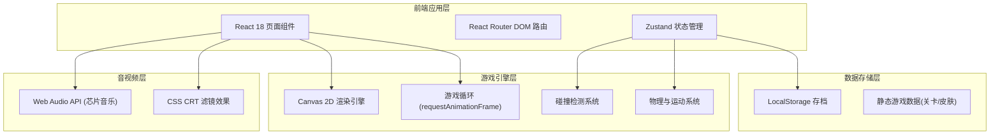

## 1. 架构设计



## 2. 技术描述

- **前端框架**：React@18 + TypeScript
- **构建工具**：Vite 5.x
- **样式方案**：Tailwind CSS 3.x + 自定义像素风 CSS 工具类
- **状态管理**：Zustand 4.x（全局游戏状态、设置、存档）
- **路由方案**：React Router DOM 6.x
- **游戏渲染**：HTML5 Canvas 2D API（固定 960x640 逻辑分辨率，像素化缩放）
- **音频方案**：Web Audio API（纯代码合成 8-bit 芯片音乐，无外部音频文件）
- **数据持久化**：LocalStorage（最高分、解锁进度、设置项）
- **图标方案**：lucide-react（纯像素场景使用 Canvas 自绘，UI 图标使用 lucide）

## 3. 路由定义

| 路由 | 页面组件 | 用途 |
|------|----------|------|
| `/` | `MainMenu` | 主菜单：开始游戏、关卡选择、收藏册、设置入口 |
| `/levels` | `LevelSelect` | 关卡选择：展示所有街区、星级、解锁状态 |
| `/game/:levelId` | `GameScreen` | 游戏核心：Canvas 渲染 + 游戏循环 |
| `/result/:levelId` | `ResultScreen` | 结算页面：得分、星级、奖励、最高分 |
| `/collection` | `Collection` | 收藏册：自行车、报纸皮肤展示 |
| `/settings` | `Settings` | 设置：怀旧滤镜、音乐、音效开关 |

## 4. 数据模型

### 4.1 核心数据类型

```typescript
// 自行车皮肤
interface BikeSkin {
  id: string;
  name: string;
  era: string;           // 年代: 50s / 70s / 90s / modern
  colors: string[];      // 像素配色
  unlockCondition: string;
  unlockValue: number;
  rarity: 'common' | 'rare' | 'epic' | 'legendary';
}

// 报纸皮肤
interface PaperSkin {
  id: string;
  name: string;
  headline: string;      // 头条文字
  colors: string[];
  unlockCondition: string;
  unlockValue: number;
  rarity: 'common' | 'rare' | 'epic';
}

// 关卡
interface Level {
  id: string;
  name: string;
  description: string;
  timeLimit: number;     // 秒
  targetDeliveries: number;
  obstacleDensity: number;
  coinDensity: number;
  mapData: number[][];   // 瓦片地图数据
  starConditions: {
    three: string;       // 三星条件描述
    threeScore: number;
    two: string;
    twoScore: number;
    one: string;
    oneScore: number;
  };
  unlockRequirement: string | null;
}

// 游戏存档
interface SaveData {
  highScores: Record<string, number>;
  starProgress: Record<string, 0 | 1 | 2 | 3>;
  unlockedBikes: string[];
  unlockedPapers: string[];
  selectedBike: string;
  selectedPaper: string;
  totalCoins: number;
  totalDeliveries: number;
  settings: GameSettings;
}

// 游戏设置
interface GameSettings {
  crtFilter: boolean;
  scanlines: boolean;
  colorShift: boolean;
  musicEnabled: boolean;
  sfxEnabled: boolean;
  musicVolume: number;
  sfxVolume: number;
}
```

### 4.2 Zustand Store 结构

```typescript
interface GameStore {
  // 存档数据
  saveData: SaveData;
  
  // 当前游戏会话状态
  currentLevel: Level | null;
  score: number;
  combo: number;
  lives: number;
  timeLeft: number;
  papersLeft: number;
  deliveries: number;
  coinsCollected: number;
  damageTaken: number;
  isPaused: boolean;
  isGameOver: boolean;
  isVictory: boolean;
  
  // Actions
  loadSave: () => void;
  saveGame: () => void;
  startLevel: (levelId: string) => void;
  updateScore: (delta: number) => void;
  addCombo: () => void;
  resetCombo: () => void;
  takeDamage: (amount: number) => void;
  deliverPaper: (success: boolean) => void;
  collectCoin: () => void;
  addTime: (seconds: number) => void;
  endGame: (victory: boolean) => void;
  updateSettings: (settings: Partial<GameSettings>) => void;
  unlockItem: (type: 'bike' | 'paper', id: string) => void;
  selectSkin: (type: 'bike' | 'paper', id: string) => void;
}
```

## 5. 项目目录结构

```
src/
├── components/
│   ├── PixelButton.tsx        # 像素风格按钮
│   ├── PixelStars.tsx         # 星级显示组件
│   ├── ScanlineOverlay.tsx    # CRT 扫描线覆盖层
│   ├── HudBar.tsx             # 游戏 HUD 顶栏
│   ├── ChargeBar.tsx          # 蓄力条组件
│   └── CollectionCard.tsx     # 收藏卡片
├── pages/
│   ├── MainMenu.tsx           # 主菜单
│   ├── LevelSelect.tsx        # 关卡选择
│   ├── GameScreen.tsx         # 游戏核心页面
│   ├── ResultScreen.tsx       # 结算页面
│   ├── Collection.tsx         # 收藏册
│   └── Settings.tsx           # 设置页
├── game/
│   ├── GameEngine.ts          # 游戏引擎主循环
│   ├── Renderer.ts            # Canvas 渲染器
│   ├── entities/
│   │   ├── Player.ts          # 玩家(自行车)实体
│   │   ├── Obstacle.ts        # 障碍物(水坑/狗/路障/汽车)
│   │   ├── Pickup.ts          # 拾取物(金币/闹钟/护盾)
│   │   ├── Paper.ts           # 投出的报纸
│   │   └── Target.ts          # 投递目标(邮箱/门口)
│   ├── collision.ts           # 碰撞检测
│   ├── physics.ts             # 物理运动
│   ├── levels/                # 关卡地图数据
│   │   ├── level1.ts
│   │   └── level2.ts
│   └── tiles/                 # 瓦片绘制函数
│       ├── road.ts
│       ├── house.ts
│       └── decoration.ts
├── hooks/
│   ├── useGameLoop.ts         # 游戏循环 hook
│   ├── useKeyboard.ts         # 键盘输入 hook
│   └── useAudio.ts            # 芯片音乐 hook
├── store/
│   └── useGameStore.ts        # Zustand 全局状态
├── data/
│   ├── bikes.ts               # 自行车皮肤数据
│   ├── papers.ts              # 报纸皮肤数据
│   └── levels.ts              # 关卡配置数据
├── utils/
│   ├── pixel.ts               # 像素绘制工具
│   ├── storage.ts             # LocalStorage 封装
│   └── audio.ts               # Web Audio 合成工具
├── App.tsx
├── main.tsx
└── index.css
```

## 6. 游戏引擎关键设计

### 6.1 游戏主循环
- 使用 `requestAnimationFrame` 驱动，固定逻辑步进 60 FPS
- 状态机：MENU → COUNTDOWN → PLAYING → PAUSED → RESULT
- 输入采样在每帧开始时处理，物理更新，最后渲染

### 6.2 瓦片地图
- 瓦片尺寸：32x32 像素
- 地图尺寸：30 x 20 瓦片 = 960 x 640 画布
- 瓦片类型编码：
  - 0 = 草地/人行道边界
  - 1 = 马路
  - 2 = 人行道
  - 3 = 房屋地基
  - 4 = 门口投递点
  - 5 = 邮箱投递点
  - 6 = 路障生成位
  - 7 = 水坑生成位

### 6.3 碰撞检测
- AABB 矩形碰撞（玩家 vs 障碍物、玩家 vs 拾取物）
- 点 vs 矩形检测（报纸 vs 投递目标）
- 空间分区优化：按瓦片划分碰撞网格

### 6.4 芯片音乐实现
- 使用 Web Audio API 的 `OscillatorNode` 合成方波
- BGM：简单 8 位旋律循环，频率对应简谱音符
- 音效：投递成功(上升音阶)、失误(下降噪音)、拾取金币(短促高音)、撞击(低频方波)
- 所有音频纯代码生成，零外部资源依赖
